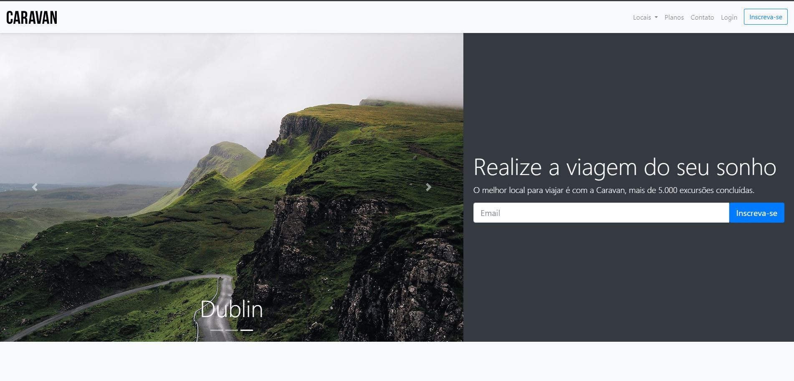

# PROJETO CARAVAN

Este projeto foi feito com o objetivo de aprender o framework Bootstrap através do curso Origamid, onde pude aprender de maneira prática a facilidade que é utilizar este framework, diminuindo consideravelmente o tempo de estruturação das páginas. 

Bootstrap nos auxilia em atividades que antes precisariamos investir um tempo maior para estilizar layouts além da parte responsiva, importante ressaltar que o conhecimento em HTML e CSS é fundamental para um bom entendimento da ferramenta, assim como seu uso.

## TECNOLOGIAS UTILIZADAS:

## LINK DO PROJETO
https://tiagoridev.github.io/bootstrap-projeto-caravan/index.html

## FALE COMIGO
Linkedin  
https://www.linkedin.com/in/tiagoribeirotech/

Email  
tiagobr.desenvolvedor@gmail.com
